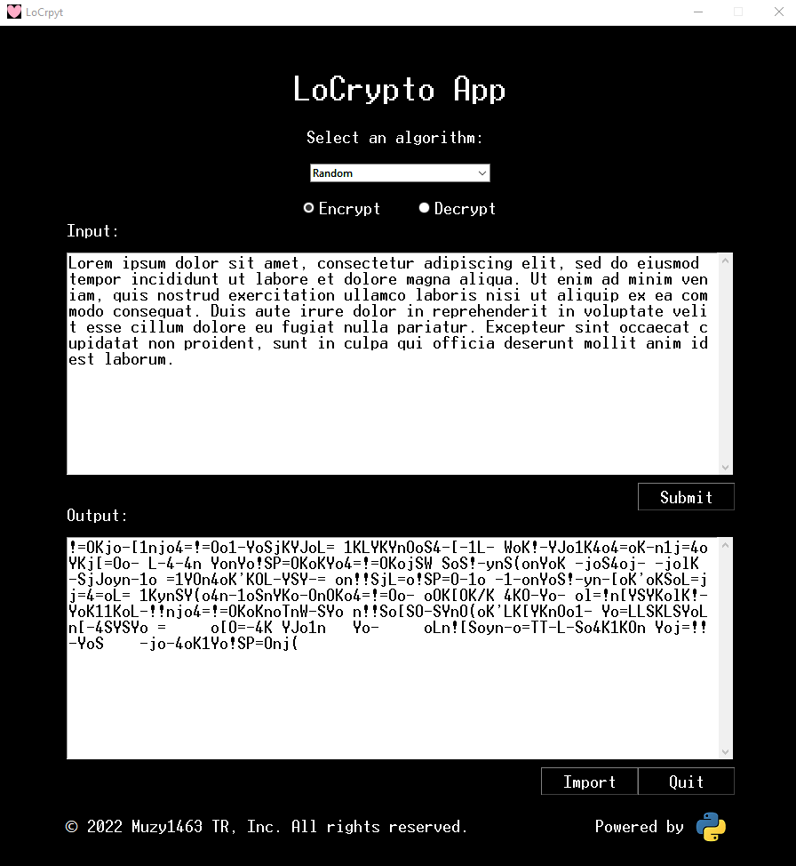
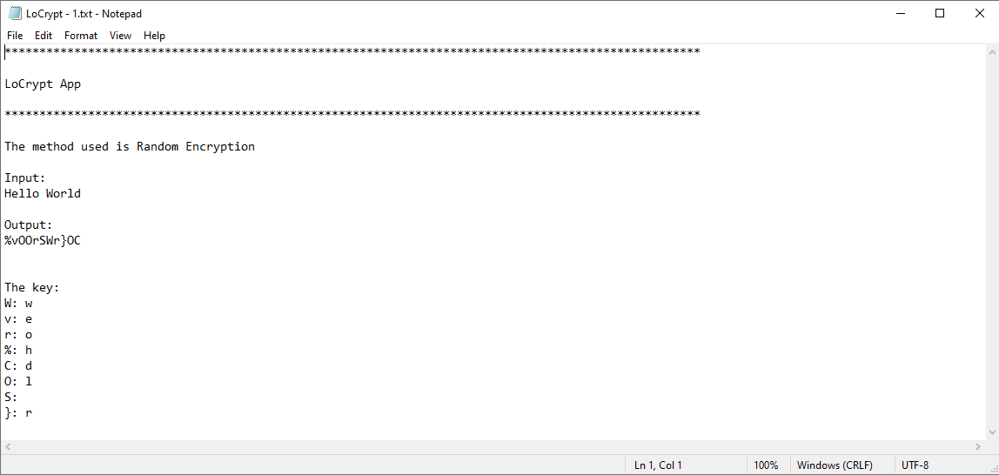

## LoCrypt

An app that encrypts and decrypts. After encryption or decryption, it can also import the input, output, and 
the key as a text file. It uses Python's the Tkinter framework, and the hashlib module.

Apart from a random algorithm, LoCrypt app uses 9 more encryption algorithms: Caesar cipher, MD5, SHA1, SHA224, SHA3-224, SHA256, SHA3-384, SHA512, SHA3-512.

After encrypting or decrypting your message, you can also import it to  a txt file.

